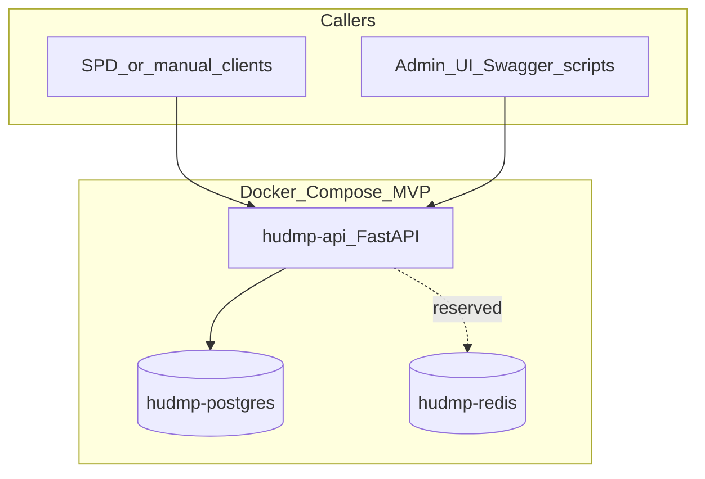

# H-UDMP MVP Architecture

> Version: v1.0  
> Status: Review  
> Date: 2026-05-05  
> Owner: H-UDMP Project Team  
> Source: [H-UDMP-SOLUTION-v4.0.md](../01-planning/H-UDMP-SOLUTION-v4.0.md), [H-UDMP-MVP-TASKBOOK-v1.0.md](../02-requirements/H-UDMP-MVP-TASKBOOK-v1.0.md)

## 1. Purpose

本文档给出 **MVP 阶段** 的运行时架构、模块边界、同步处理路径，以及与总体方案（V4）的对照关系，避免实施时被全文范围牵引。

**MVP 在 V4 中的位置**：仅实现「科室主数据 + 耗材 27 位码主数据 + 映射桥 + 审核任务 + 交换日志 + 幂等 + NHSA 暂存/导入 + 医疗器械分类参考抽取 + Admin UI Alpha 轻量操作员会话」。不实现 FHIR、外报网关、药品/诊疗项目、Blueprint 发布、完整企业级 IAM/SSO、冷热分离等（见任务书范围外章节）。

## 2. Runtime Components



| 组件 | 职责 |
|---|---|
| `hudmp-api` | HTTP API、操作员会话/API Key 认证、权限校验、业务编排、OpenAPI、Admin UI Alpha API |
| `hudmp-postgres` | 主数据、映射、审核、交换日志、NHSA 暂存、器械分类参考 |
| `hudmp-redis` | Compose 预留组件；当前 MVP 未接入队列/缓存，幂等 **权威存储为 PostgreSQL**（`sys_exchange_log` 唯一键） |

## 3. Logical Modules

| 模块 | 职责边界 |
|---|---|
| API 层 | 路由、`X-API-Key`/`X-Session-Token`、轻量角色权限、统一信封、`trace_id`、分页参数 |
| 写入/idempotency | 计算 `payload_hash`，查询 `sys_exchange_log`，冲突返回 `IDEMPOTENCY_CONFLICT` |
| 导入服务 | 上传大小限制 → 同步读取或异步 spool → CSV/Excel/DOCX 解析 → 行级校验 → 批量写入业务表或暂存表 → 导入报告 |
| 主数据服务 | `dict_departments`、`dict_material_specs` CRUD/检索 |
| 映射服务 | `sys_mapping_bridge` 查询、`sys_mapping_review_task` 创建与审批 |
| 交换日志 | 每次写入型操作结束状态写入 `sys_exchange_log`（成功/失败/冲突） |
| Admin UI Alpha 支撑 | 操作员登录、权限矩阵、预置操作员清单、证据工作台所需 API |

**执行边界（MVP）**：小型科室/耗材导入和映射解析仍为请求线程内同步完成；大文件导入通过 `POST /api/v1/import-tasks/materials` 写入服务端 spool，并由 FastAPI `BackgroundTasks` 在 API 进程内执行。当前不引入独立消息队列、异步 Worker、重试或死信；Redis 仅为 Compose 预留组件。

## 4. Request Path — Mapping Resolve

```text
POST /api/v1/mapping/resolve
  → 认证
  → 幂等检查（exchange_log）
  → 按 category 查 ACTIVE 映射
  → 命中：SUCCESS + MATCHED
  → 未命中：创建或复用 PENDING 审核任务 → SUCCESS + PENDING_REVIEW（HTTP 200，业务含义见 API 规范）
  → 冲突：MAPPING_CONFLICT
```

**说明**：`MAPPING_NOT_FOUND` 在 API 规范错误码表中指「未匹配且已创建审核任务」类语义；实现上对外仍以 **HTTP 200 + success 信封 + data.status=PENDING_REVIEW** 为主流路径，便于客户端统一解析信封字段。

## 5. Request Path — Write + Idempotency + Exchange Log

对所有 **写入型** 接口（导入、`mapping/resolve`、审核通过/拒绝），顺序如下：

```text
1. 校验 API Key 与输入
2. 解析 source_system + source_tx_id + 规范化 payload → payload_hash
3. SELECT sys_exchange_log WHERE (source_system, source_tx_id)
   - 存在且 payload_hash 相同 → 返回已存储的响应摘要（HTTP 200，幂等重放）
   - 存在且 payload_hash 不同 → CONFLICT（409，IDEMPOTENCY_CONFLICT）
4. 执行业务事务（主数据/暂存/映射/审核）
5. INSERT sys_exchange_log（SUCCESS / FAILED / CONFLICT）
6. 返回信封响应
```

步骤 5 与步骤 4 应在 **同一数据库事务** 内提交，避免出现「业务成功但日志未落库」。

## 6. Import Pipeline Boundaries

| source_type | 主要写入目标 | 备注 |
|---|---|---|
| `MVP_TEMPLATE` | `dict_*` | 院方模板列校验 |
| `NHSA_FULL_SPEC` | `stg_nhsa_material_specs` → 规范化写入 `dict_material_specs` | 字段字符串化，禁止当数字解析 |
| `NHSA_DISABLED` | `stg_nhsa_material_disabled` | 与主数据状态联动规则见导入映射文档 |
| `NHSA_TRANSCODE` | `stg_nhsa_material_transcode` | 保留「变更/映射」语义 |
| `DEVICE_CLASSIFICATION_CATALOG` | `ref_device_classification_catalog` | DOCX 多表遍历 |

### 6.1 Async Import Task Boundary

```text
POST /api/v1/import-tasks/materials
  → 认证与 imports.manage 权限
  → 校验 source_type 与 batch_id 幂等
  → 按 HUDMP_IMPORT_MAX_UPLOAD_BYTES 限制上传大小
  → 写入 HUDMP_IMPORT_SPOOL_DIR/{batch_id}/...
  → 创建 sys_import_batch(PENDING)
  → BackgroundTasks 触发 run_import_batch
  → RUNNING / COMPLETED / COMPLETED_WITH_ERRORS / FAILED
  → 默认删除本次 spool 文件
```

限制说明：

- API 进程重启可能中断正在运行的后台导入。
- 多 API 副本部署前应先接入 Redis/Celery、RQ 或等价队列，并定义任务重试、死信和容量告警。
- `sys_import_batch.source_file_path` 保留服务端路径用于排障追溯，但默认完成后文件已删除。

## 7. Security (MVP)

- 脚本和服务间调用仍兼容服务级 `X-API-Key`，内网假设；错误响应不返回堆栈与连接串。
- Admin UI Alpha 使用管理员预置的用户名/工号 + 密码登录，后端签发 HMAC 会话令牌，前端后续提交 `X-Session-Token`。
- 轻量角色权限矩阵包含 `platform_admin`、`data_steward`、`auditor`，并对导入、映射、交换日志、权限管理、原始失败载荷查看做服务端校验。
- 当前不提供企业级 SSO、密钥轮换、不可篡改审计日志；院内部署前应升级到 JWT/OIDC、mTLS 或等价 IAM 方案。

## 8. Related Documents

| 文档 | 路径 |
|---|---|
| API 契约 | [H-UDMP-API-SPEC-v1.0.md](../04-api/H-UDMP-API-SPEC-v1.0.md) |
| 数据模型 | [H-UDMP-DATA-MODEL-v1.0.md](../05-data/H-UDMP-DATA-MODEL-v1.0.md) |
| 导入源映射 | [H-UDMP-IMPORT-SOURCE-MAPPING-v1.0.md](../05-data/H-UDMP-IMPORT-SOURCE-MAPPING-v1.0.md) |
| 部署手册 | [H-UDMP-DEPLOYMENT-RUNBOOK-v1.0.md](../07-operations/H-UDMP-DEPLOYMENT-RUNBOOK-v1.0.md) |
